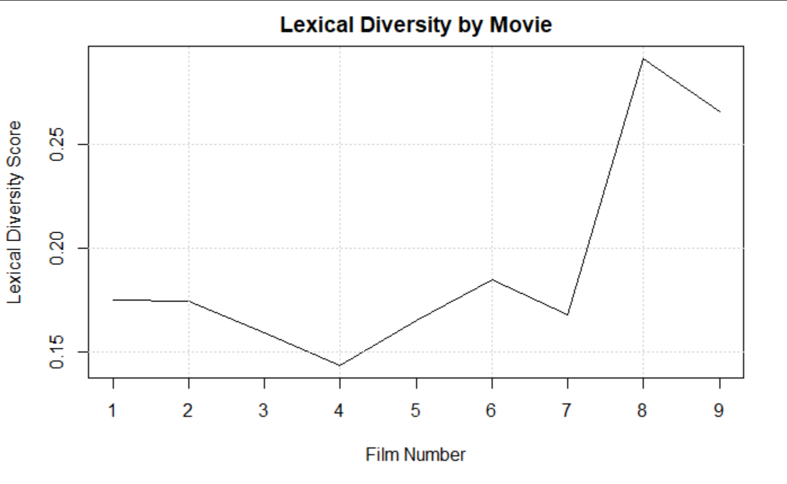
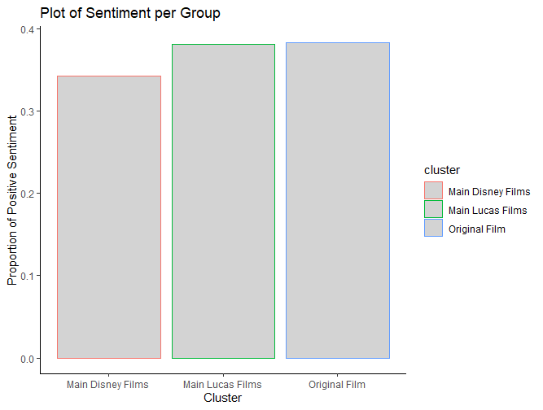

# Purpose

---

Star Wars is a cultural phenomenon, its films started in 1977 and are still topping the charts today. Its brand has been 
successfully made videogames, merchandise, television shows, and even amusement parks. This success does raise the 
question, what made these movies the massive success that they are? By having a computer read through and analyze the 
movies I hope to glean new insights about their success. Furthermore, fans often have polarized opinions as to what 
films are better, this may help to give a more concrete reasoning for why some films may be liked more than others. 

# Data and Models

---

This work is using text files of the Star Wars transcripts, taken from wookiepedia [4]. The protection on the text is such that
as long as I am not profiting off of the work and cite the source I got it from it is fair-use. The text files in this
repo are those transcripts so if you wish to build on this work keep that in mind when using the files. 

The functions script contains all the helper functions I built for this work, most of them are involved for cleaning the
text. Therefore, if you are looking at the data cleaning in the markdown check the functions file to see what I did under 
the hood. It's nothing interesting, simple stopword and name removal, stemming, etc. 

For the analysis of this work I started with a wordcloud and moved onto clustering, frequent word analysis, and finally
sentiment analysis. There is no single results but instead a number of different conclusions gleaned from each analysis. 
To learn more of the specifics check either the "Text Analysis: A Star Wars Story" writeup or presentation. The former
is better for a more comprehensive understanding, but the presentation is better for a quick skim. The analysis html
file displays the information that was used for the analysis but none of the analysis itself. The analysis markdown and
functions script have all the code used for this work. Additionally, the visuals used for the analysis are included below. 

# Plots and Other Visuals

---

# References

---

1. Clarke, Isobelle, and Jack Grieve. “Stylistic Variation on the Donald Trump Twitter Account: A Linguistic
Analysis of Tweets Posted between 2009 and 2018.” Plos One, vol. 14, no. 9, 2019,
doi:10.1371/journal.pone.0222062.
2. Stamatatos, Efstathios. “Authorship Attribution Using Text Distortion.” Proceedings of the 15th
   Conference of the European Chapter of the Association for Computational Linguistics: Volume 1, Long
   Papers, 2017, doi:10.18653/v1/e17-1107.
3. Hu, Wei. “Unsupervised Learning of Two Bible Books: Proverbs and Psalms.” Sociology Mind, vol. 02, no.
   03, 2012, pp. 325–334., doi:10.4236/sm.2012.23043.
4. “Star Wars Transcripts.” Transcripts Wiki, transcripts.fandom.com/wiki/Category:Star_Wars_transcripts.
5. “Copyrights.” Wookieepedia, starwars.fandom.com/wiki/Wookieepedia:Copyrights.
6. Ingo Feinerer, Kurt Hornik, and David Meyer (2008). Text Mining Infrastructure in R. Journal of Statistical
   Software 25(5): 1-54. URL: https://www.jstatsoft.org/v25/i05/.
7. Silge J, Robinson D (2016). “tidytext: Text Mining and Analysis Using Tidy Data Principles in R.” _JOSS_,
   *1*(3). doi: 10.21105/joss.00037 (URL: https://doi.org/10.21105/joss.00037), <URL:
   http://dx.doi.org/10.21105/joss.00037>.
8. Emil Hvitfeldt (2020). textdata: Download and Load Various Text Datasets. R package version 0.4.1.
   https://CRAN.R-project.org/package=textdata
9. H. Wickham. ggplot2: Elegant Graphics for Data Analysis. Springer-Verlag New York, 2016.
10. Benoit K, Watanabe K, Wang H, Nulty P, Obeng A, Müller S, Matsuo A (2018). “quanteda: An R package for
    the quantitative analysis of textual data.” _Journal of Open Source Software_, *3*(30), 774. doi:
    10.21105/joss.00774 (URL: https://doi.org/10.21105/joss.00774), <URL: https://quanteda.io>.
11. Hadley Wickham, Romain François, Lionel Henry and Kirill Müller (2020). dplyr: A Grammar of Data
    Manipulation. R package version 1.0.2. https://CRAN.R-project.org/package=dplyr
12. Dawei Lang and Guan-tin Chien (2018). wordcloud2: Create Word Cloud by 'htmlwidget'.R package
    version 0.2.1. https://CRAN.R-project.org/package=wordcloud2
13. Hadley Wickham (2020). tidyr: Tidy Messy Data. R package version 1.1.2. https://CRAN.Rproject.org/package=tidyr
14. Grün B, Hornik K (2011). “topicmodels: An R Package for Fitting Topic Models.” _Journal of Statistical
    Software_, *40*(13), 1-30. doi: 10.18637/jss.v040.i13 (URL: https://doi.org/10.18637/jss.v040.i13).
15. Hadley Wickham and Jim Hester (2020). readr: Read Rectangular Text Data. R package version 1.4.0.
    https://CRAN.R-project.org/package=readr
16. Alboukadel Kassambara and Fabian Mundt (2020). factoextra: Extract and Visualize the Results of
    Multivariate Data Analyses. R package version 1.0.7. https://CRAN.R-project.org/package=factoextra